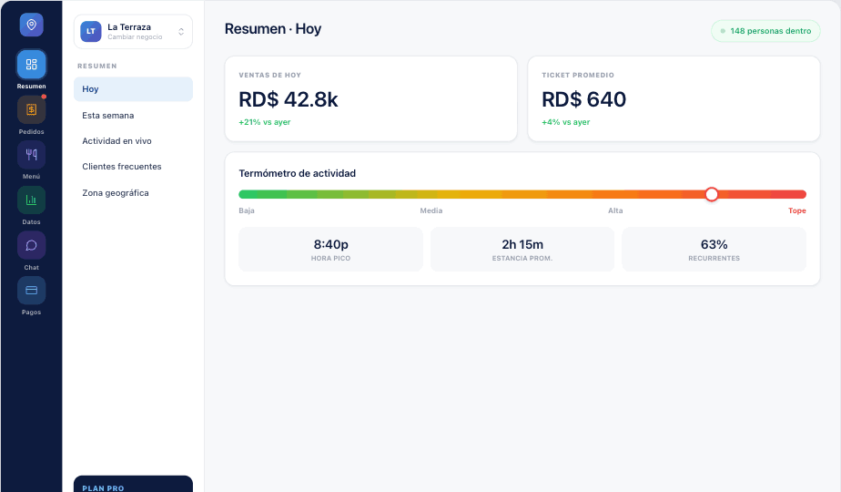

# Diseño elegido: 4A — Riel de iconos con chips de color

Este es el diseño **seleccionado** para implementar. Las demás opciones del
prototipo (1c, 3a, 4b, 4c) quedan solo como referencia histórica.

## Idea en una frase
Panel de negocio (escritorio) con un **riel de navegación compacto** donde cada
icono vive dentro de un **chip redondeado tintado con el color de su módulo** y
etiqueta de texto debajo — para que los iconos se distingan bien y no se vean
pequeños, sin ocupar una barra lateral ancha.

## Estructura (3 columnas)
1. **Riel de iconos** (100px, navy `#0D1B3E`) — logo arriba, 6 módulos con chip
   de color + label, avatar del dueño abajo. El módulo activo usa chip de color
   sólido con anillo de selección; los inactivos, chip tintado ~18–22%.
2. **Subnavegación contextual** (230px, blanco) — selector de negocio arriba,
   lista de subsecciones del módulo activo, tarjeta de plan abajo.
3. **Contenido** (Resumen) — encabezado con chip "en vivo", tarjetas de métrica
   y "Termómetro de actividad".

## Por qué 4A
- Iconos claramente visibles y diferenciados por color de módulo.
- Riel angosto → más espacio para el contenido que una barra ancha.
- Subnavegación contextual evita menús profundos.
- 100% dentro del JChat Design System (navy, gradiente marca, hairlines 0.5px,
  títulos en medium).

## Para el detalle completo
Ver **README.md** (spec exhaustiva: medidas, colores exactos, tipografía,
estados, tokens, iconos Lucide) y el prototipo **Dashboards.dc.html** (opción
con id `4a`).

## Contenido del paquete
- `README.md` — especificación técnica completa.
- `DESIGN.md` — este resumen del diseño elegido.
- `Dashboards.dc.html` — prototipo HTML (implementar la opción `4a`).
- `screenshots/4a-dashboard.png` — captura del diseño 4A.
